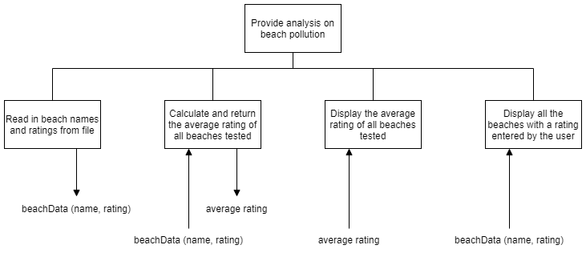
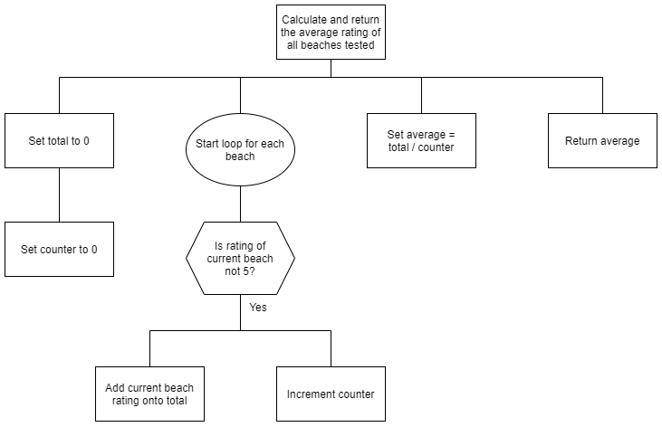
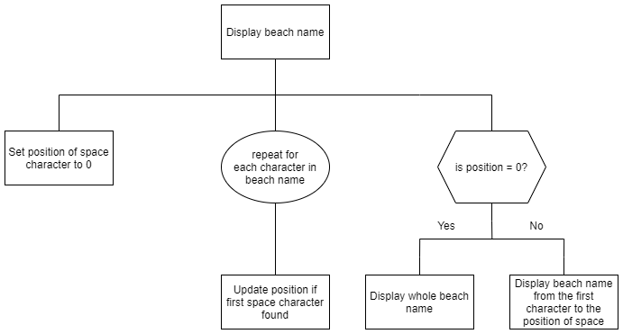

# Water Quality

## Introduction

The Marine Conservation Society collects data on the amount of pollution on UK beaches and gives each beach a rating.

|  |  | Rating |
| --- | --- | :---: | 
| Excellent | (excellent water quality and local sewage treatment) | 1 |
| Good | (good water quality) | 2 |
| Poor | (water quality meets minimum standards) | 3 |
| Fail | (water quality below minimum standards) | 4 |
|Not tested |  | 5

## Program analysis

A program is required to read the beach pollution data from a CSV file.
This file contains the names of 973 UK beaches, along with a rating for each beach.

When run, the program should:
* display the average rating for all beaches tested
* prompt the user to select a rating and display the names of all beaches with that rating

## Assumptions

* the data file is formatted correctly and is error-free
* each line of the data file stores the name and rating (1 to 5) for a single beach, as shown below:

Aber Mawr Bay,1  
Aberaeron - Harbour (Fourth Groyne North),5  
Aberafan,3  
Aberarth,3  
...

## Functional requirements

### Inputs
* data from the file (name of beach and rating)
* user enters rating for the beaches to be displayed
### Processes
* calculate the average rating for all beaches tested (those with a rating between 1 and 4)
* only display names of beaches with a rating entered by the user
### Outputs
* the average beach rating for all beaches tested
* the name of all beaches with a rating entered by the user

## Program design
(structure diagram)

Top level design with data flow

Refinement of ‘Calculate and return the average rating for all beaches tested’

Refinement of ‘Display all the beaches with a rating entered by the user’

___2a___ Using the program analysis and design, identify two boundaries in this problem. __(2 marks)__

* Boundary 1
* Boundary 2

___2b (i)___ Using the program analysis and design, implement the program in a language of your choice. Your program should:
* be maintainable and modular
* use a function to ‘calculate and return the average rating for all beaches tested’
* use a procedure to ‘display all the beaches with a rating entered by the user’
* match the top level design and the refinements provided
Print (just SCREENSHOT for practice task) evidence of your program code. __(12 marks)__

___2b (ii)___ The process ‘display all the beaches with a rating entered by the user’ currently
displays the complete name of each beach.

The program is redesigned so that if the beach name is longer than one word, only the first word is displayed.

For example: ___Aberdaron Beach___ becomes ___Aberdaron___

A refinement of ‘Display beach name’ is shown on the following page. This finds the position of the first space character in the string and displays only the characters up to this position.

Using the above design, alter your program code so that only the first word in the beach name is displayed.

Print (just SCREENSHOT for practice task) evidence of your altered program code. __(3 marks)__

___2c___ Describe a comprehensive test plan that could be used to test the program inputs. __(3 marks)__

___2d___ Identify where a breakpoint could be used to test that only the beach names with a rating entered by the user are displayed.

Mark this clearly on one of the printouts of your code. __(1 mark)__

___2e___ With reference to your own program code, evaluate:
* the robustness of your program if additional beach data was added to the CSV file __(1 mark)__
* the usability of your program __(2 marks)__
* the maintainability of your program __(2marks)__